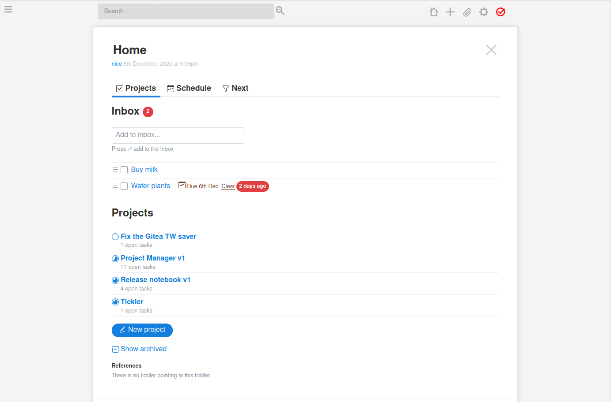
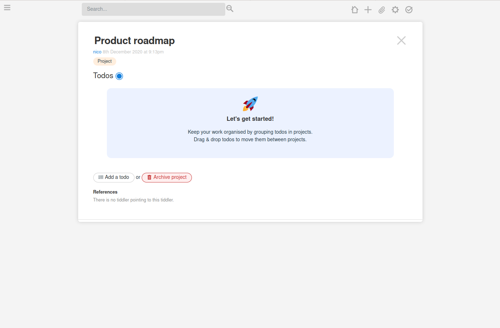
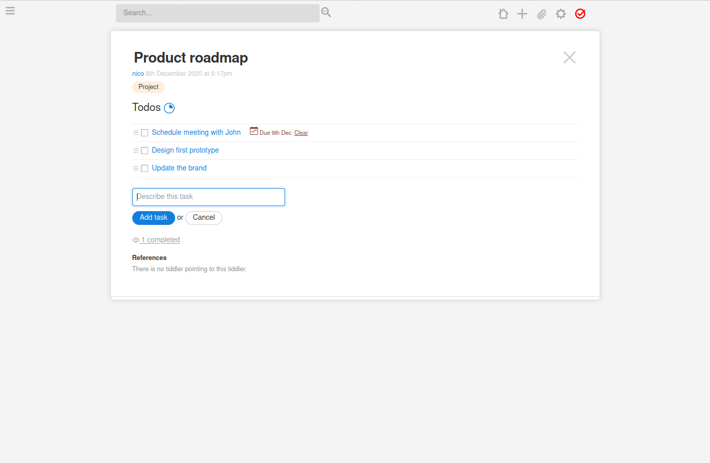
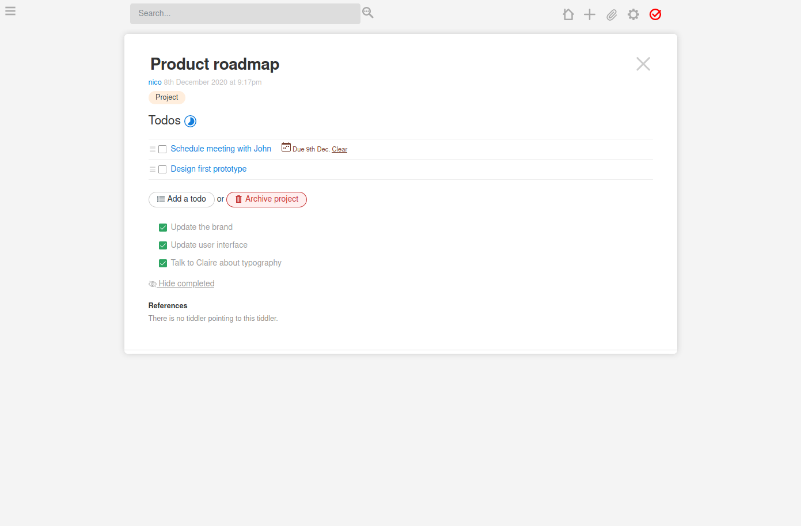

# Projectify

Projectify -- previously known as ProjectManager -- is a simple
[TiddlyWiki](https://tiddlywiki.com) plugin for managing projects & todo lists,
inspired by other tools such as [Todoist](https://todoist.com) and
[Basecamp](https://basecamp.com).

## Install

See https://nicolas.petton.fr/tw/projectify.html#Installation

## Demo & Screenshots

A demo is available at
[nicolas.petton.fr/tw/projectify.html](https://nicolas.petton.fr/tw/projectify.html).

## ChangeLog

An up-to-date ChangeLog can be found [here](./plugins/projectify/tiddlers/changelog.tid).

##### Release 0.6.0

###### Features

* Todos can now moved between projects using drag & drop
* Todos can now be made into sub-projects by clicking the `Make this into a sub-project` button
* Empty projects and Inbox now show a welcome screen
* New checkbox button in the view toolbar of todo tiddlers
* New form to add new projects including an input for the project title
* The number of todos in a project is now represented with a small pie chart icon
* New card view of active projects in the dashboard
* Projects in the dashboard can now be reordered
* Projects without active todos are now omitted from the "Next" dashboard section
* New Schedule button in the page controls listings all todos scheduled today
* New list in the Schedule tab of the dashboard listing all item scheduled to be done after the next 30 days.

###### Improvements

* New icon set
* Improved style for checkboxes, buttons and inputs
* Improved style for the dashboard projects section
* Improved layout for completed todos in a project
* Added a drag handle for draggable todo items

###### Fixes

* Fix creation of projects with triple double quotes
* Fix creation of todos with triple double quotes
* Fix drag&drop of todos with double quotes or triple double quotes

###### Breaking changes

* The `<<project>>` macro should not be used anymore. Instead, the plugin adds the <<tag SubProject>> tag to sub projects and renders their todo-list automatically.
* Projects are now archived using the <<tag done>> tag. The former `Archived` tag is not used anymore.
